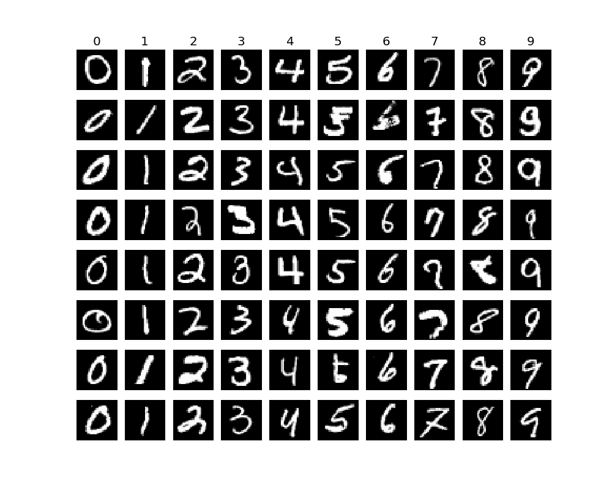

# Digit Recognizer

Python based approach for solving the Digit Recognizer Kaggle challenge

https://www.kaggle.com/c/digit-recognizer

### Main Idea

1. Use the following classifiers

      - `RandomForestClassifier`
      - `KNeighborsClassifier`

    With the aim of getting the maximum `accuracy`

2. Also, we will use our old friend `GridSearchCV` for getting the optimal values of 
parameters for initializing the above classifiers.

3. Lastly, we will combine both of these classifiers to create an **ensemble**. We will be using the `VotingClassifier`

### Set up

1. Anaconda for python 3.5
2. Required packages can be found in requirements.txt

### Layout

1. `src` folder contains all of the packages
2. `resources` folder contains
    1. `data` :-> This should have two folders. `train` for training data and `test` for test data.
    2. `models` :-> Store your models and classifers here, if needed.
    3. `params` :-> The optimal values of parameters after `GridSearchCV` are stored here.
    4. `results` :-> Store prediction results here.
             
### Packages

***plots***

This has a single module named `Visualize`, which can be used for looking into the data via `seaborn`

***loader***

This has a single module named `Load_Data` that reads the `csv` files and returns `pandas` `DataFrames`

***predict***

This has four modules

1. `Predict_KNN` :-> Predict using `KNeighborsClassifier`
2. `Predict_RForest` :-> Predict using `RandomForestClassifier`
3. `Ensemble` :-> Predict using `VotingClassifier` that combines the other two classifiers
4. `Get_Optimal` :-> Helper module for generating the optimal set of parameters for a classifier using `GridSearchCV`

###Approach

Lets take a look at the data we are dealing with

Run the `Visualize.py` module in the `plots` package, and we see

Each little square has 768 pixels in total. If we look at the `train.csv`, a row looks like

	label	|	pixel0	|	pixel1	|	pixel2	|	pixel3	|	pixel4	|...	pixel768

	1    	|	0   	|	0     	|	0     	|	0     	|	0   	|...	0 

**Key Idea**

Think of each pixel as a `feature` for a classifier. So when we are training our classifier, we want to train
on how many and which of the pixels are turned on or off.  

With this knowledge, we are in a good position to pick the classifier we want to use. In my opinion, this problem space is ideal for 

1. `RandomForestClassifier` as here, we would be building one decision tree per pixel.
2. `KNeighborsClassifier` as clusters can be formed by looking at, well, clusters of pixels, that are
simultaneously turned on or off for a given label.

### Flow

The common steps for prediction are 

1. Read `train.csv` and `test.csv` using `pandas` and create train-test splits
2. Initialize the classifier
3. Initialize set of hyper-parameters. These would be used by GridSearch to derive optimal set of hyper-parameters
4. Initialize scoring metric for this problem space, which would be `accuracy`
5. Generate optimal set of hyper-parameters for the above classifier using `Get_Optimal` module which uses `GridSearchCV`
6. Reinitialize the classifier but now with the optimal hyper-parameters
7. Train the classifier
8. Predict on the test data

and specifically

1. Run `Predict_KNN` for predicting using `KNeighborsClassifier`
2. Run `Predict_RForest` for predicting using `RandomForestClassifier`
3. Run `Ensemble` for predicting using `VotingClassifier` that combines the other two classifiers

Please follow the well documented code.  

### Results 

1. `RandomForestClassifier` with {"warm_start": true, "n_estimators": 150, "verbose": 100, "oob_score": false, "bootstrap": true} gets **0.96500**
2. `KNeighborsClassifier` with {'algorithm': 'kd_tree', 'n_neighbors': 1} gets **0.96900**
3. Ensemble `VotingClassifier` with {"voting": "soft", "weights": [2, 1]} and the above optimal classifiers, gets **0.97286** 